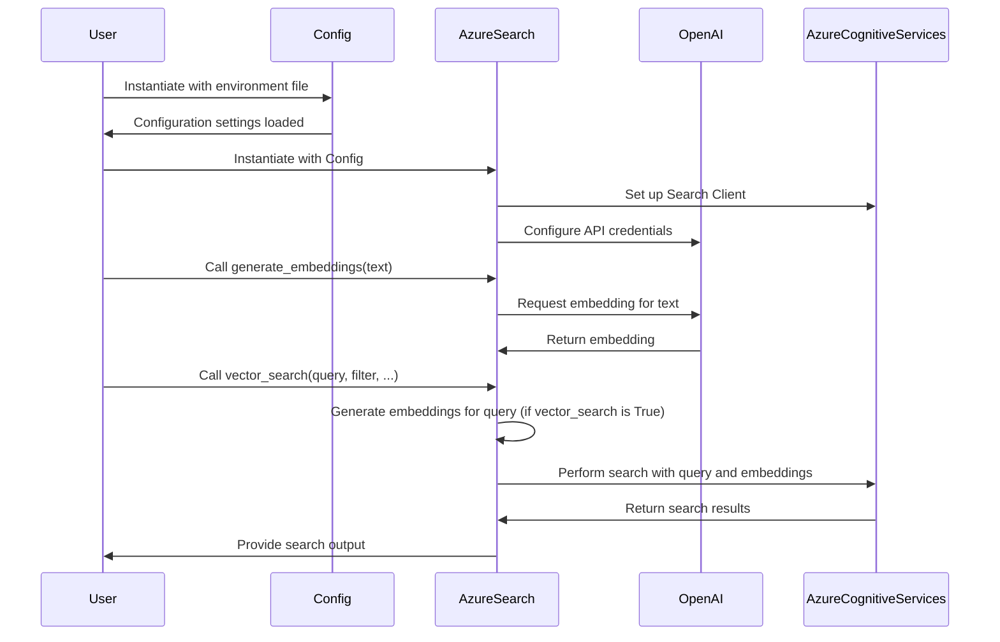

# **NOTE**: Need to add SemanticRanker to function

# Description

The code snippet defines two primary classes, `Config` and `AzureSearch`, designed to integrate Azure Cognitive Search and OpenAI for enhanced text processing and search capabilities. `Config` is responsible for managing environment configurations, while `AzureSearch` handles the core functionalities of embedding generation and vector search.

# Functions / Methods

## Config Class:
- **Purpose**: Manages configuration settings.
- **Methods**:
  - `__init__(self, path='./environment.env')`: Loads environment variables from a specified file. It sets up various configuration parameters related to Azure Search Service and OpenAI API.

## AzureSearch Class:
- **Purpose**: Handles operations related to Azure Cognitive Search and OpenAI.
- **Methods**:
  - `__init__(self, config, index_name)`: Initializes the AzureSearch class with configurations from `Config`. It sets up the Azure Search Client and configures OpenAI credentials.
  - `generate_embeddings(self, text)`: Generates embeddings for a given text using OpenAI. The method trims text if it exceeds a token limit and handles rate limits with retries.
  - `vector_search(self, query, filter, k=5, select_fields=None, vector_search=True)`: Performs a vector search on the Azure Cognitive Search index. The method supports both traditional keyword search and vector-based search, controlled by the `vector_search` parameter.

# Mermaid Sequence Diagram

