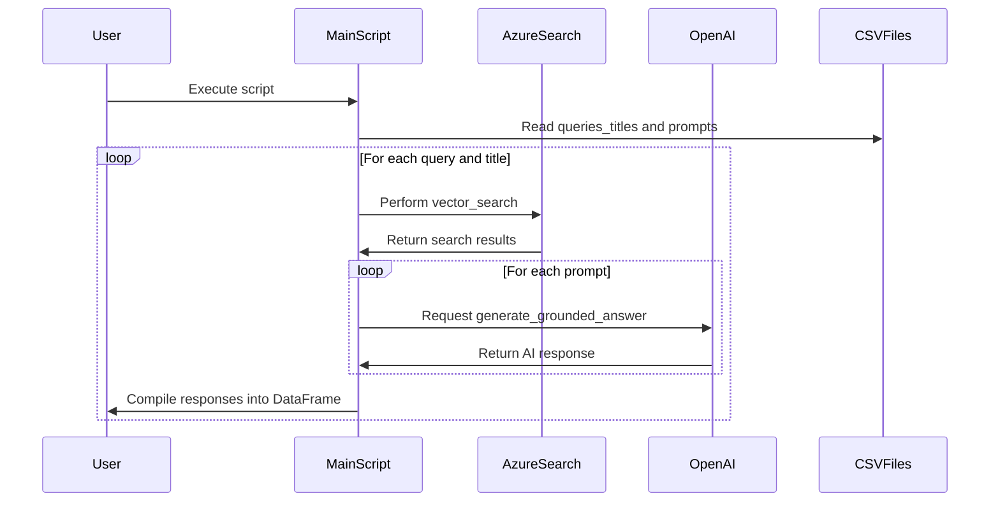

# Description

This Python script demonstrates an advanced use of the AzureSearch class (referenced from a previous code snippet) for processing and generating responses to queries. It integrates Azure Cognitive Search, OpenAI's GPT model, and data processing with pandas. The script is designed to read queries and prompts from CSV files, perform vector searches using AzureSearch, and generate responses using OpenAI's language model.

# Functions / Methods

- `generate_grounded_answer(query, content, system, reminder, config=config)`: This function is responsible for generating responses to user queries. It formats the query and content, constructs a message to be sent to the OpenAI model, and extracts the reply from the model's response.

- `concatenate_sources(results)`: Sorts and concatenates search results into a single string. It processes each result item to format titles, citation IDs, and content, which is then compiled into a unified text.

- `process_queries_and_generate_responses(queries_titles, index_name, k, prompts, config=config)`: Main function of the script. It reads queries and titles from a CSV file, performs vector searches for each query, and then generates responses using the OpenAI model for each prompt. The function compiles all responses into a pandas DataFrame.

- VectorSearch Configuration: The script includes a configuration for VectorSearch with HnswVectorSearchAlgorithm, setting parameters like 'm', 'efConstruction', 'efSearch', and 'metric'.

# Mermaid Sequence Diagram

