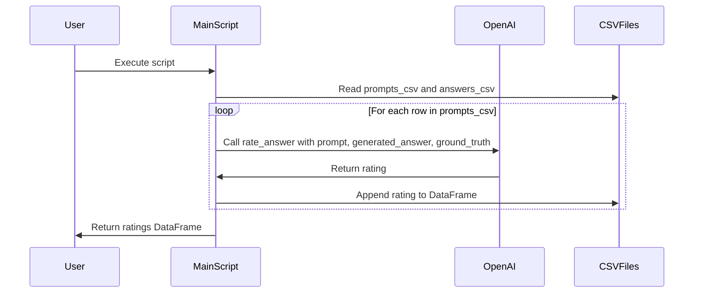

# Description

This Python script extends the functionality of the AzureSearch and OpenAI integration to include a rating system for answers generated by the OpenAI model. It reads prompts, generated answers, and ground truths from CSV files, and uses the OpenAI API to rate the quality of the generated answers against the ground truths.

# Functions / Methods

- `rate_answer(prompt, generated_answer, ground_truth)`: Rates the generated answer against the ground truth using the OpenAI model. It constructs a message object with the prompt, generated answer, and ground truth, and then requests the model to score the generated answer. The function returns the model's rating.

- `process_and_rate_answers(prompts_csv, answers_csv)`: Processes CSV files containing prompts, generated answers, and ground truths. It calls the `rate_answer` function for each row, collects the ratings, and compiles them into a pandas DataFrame.

# Mermaid Sequence Diagram

