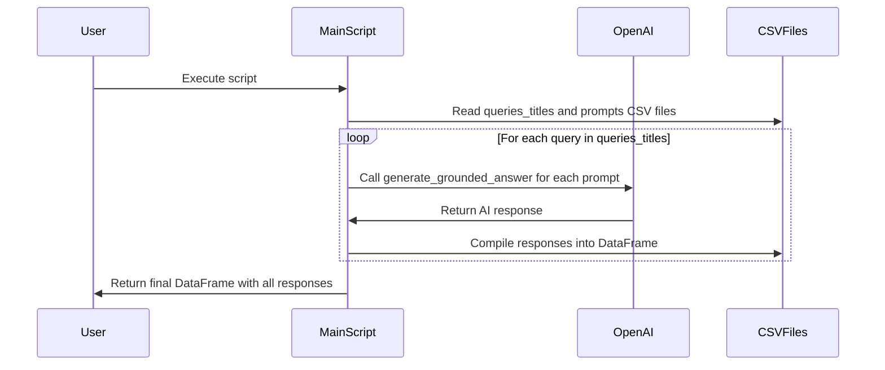

# Description

This Python script integrates Azure Cognitive Search and OpenAI to process queries and generate responses. The script reads query and title information from a CSV file and uses OpenAI's GPT model to generate responses based on different prompts. It aims to provide AI-powered answers to a set of predefined queries and titles.

# Functions / Methods

- `generate_grounded_answer(query, content, system, reminder, config=config)`: Generates an AI response for a given query. It formats the query and additional context into a message, sends it to the OpenAI model, and returns the model's response.

- `process_queries_and_generate_responses(queries_titles, prompts, config=config)`: Processes queries and titles from a CSV file and generates AI responses for each query. It iterates over each row in the DataFrame, calls `generate_grounded_answer` for each prompt, and compiles the responses into a new DataFrame.

# Mermaid Sequence Diagram

