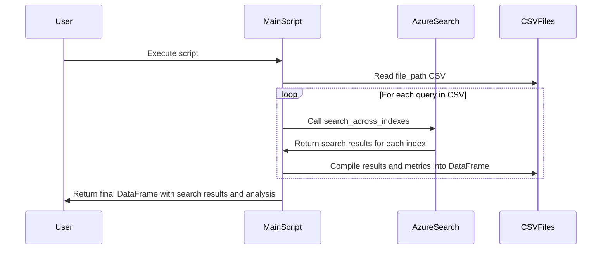

# Description

This Python script uses the AzureSearch class for performing vector searches across multiple indexes. The script is designed to process queries from a CSV file, perform searches using the Azure Cognitive Search and OpenAI, and analyze search results. The main functionality is to search across different indexes and compile the results into a comprehensive pandas DataFrame.

# Functions / Methods

- `search_across_indexes(query: str, vector_search, config: Config, index_names: list) -> dict`: Performs searches across multiple indexes specified in `index_names` using AzureSearch's vector search functionality. It compiles and returns search results in a dictionary format.

- `get_search_results_for_csv(file_path: str, index_names: list, vector_search: bool = True) -> pd.DataFrame`: Reads a CSV file to get queries and expected titles, calls `search_across_indexes` for each query, and processes the results. It calculates various metrics like standard deviation and mean for the search scores and compiles everything into a pandas DataFrame.

# Mermaid Sequence Diagram

